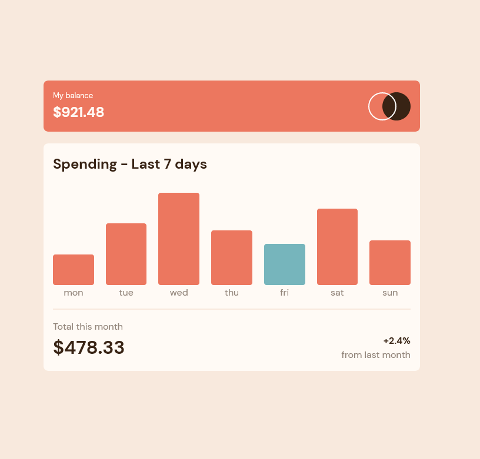

# Expenses chart component solution

This is a solution to the[Expenses chart component challenge on Frontend Mentor](https://www.frontendmentor.io/challenges/expenses-chart-component-e7yJBUdjwt)

## Table of contents

- [Overview](#overview)
    - [The challenge](#the-challenge)
    - [Screenshot](#screenshot)
    - [Links](#links)
- [My process](#my-process)
    - [Built with](#built-with)
    - [What I learned](#what-i-learned)
    - [Useful resources](#useful-resources)
- [Author](#author)

## Overview

### The challenge

Users should be able to:

- View the bar chart and hover over the individual bars to see the correct amounts for each day
- See the current day’s bar highlighted in a different colour to the other bars
- View the optimal layout for the content depending on their device’s screen size
- See hover states for all interactive elements on the page
- **Bonus**: Use the JSON data file provided to dynamically size the bars on the chart

### Screenshot

### Links

- Solution URL: [GitHub](https://github.com/Matej-ch/expenses-chart-component)
- Live Site URL: [GH pages](https://matej-ch.github.io/expenses-chart-component/)

## My process

### Built with

- Semantic HTML5 markup
- CSS custom properties
- [Vite](https://vitejs.dev/)
- [React](https://reactjs.org/) - JS library
- [Scss](https://sass-lang.com/)

### What I learned

I learned about using react and typescript

### Useful resources

- [React docs](https://reactjs.org/docs/getting-started.html)
- [Typescript docs](https://www.typescriptlang.org/docs/)

## Author

- Website - [matej ch](https://www.matejchalachan.com/)
- Frontend Mentor - [@Matej-ch](https://www.frontendmentor.io/profile/Matej-ch)